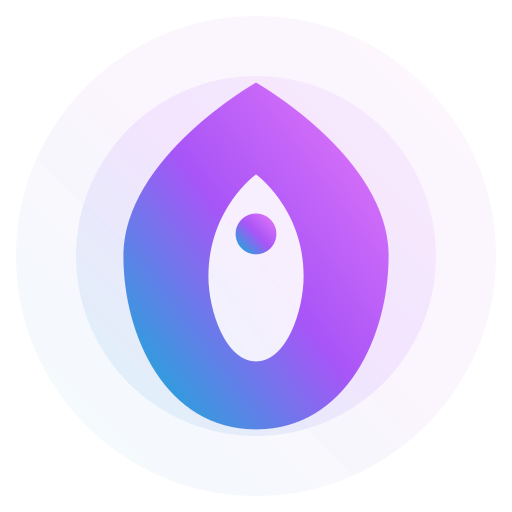

<div align="center">
  
  <h1>AI Common</h1>
  <p><strong>External Brain Infrastructure for AI Collaboration</strong></p>
  <p>统一规则 · 可演进知识 · 多 Agent 协同</p>

  <p>
    <a href="https://webkubor.github.io/AI_Common/"><strong>在线文档</strong></a>
    ·
    <a href="#快速开始">快速开始</a>
    ·
    <a href="#架构说明">架构说明</a>
    ·
    <a href="#仓库边界">仓库边界</a>
  </p>

  <p>
    <a href="https://github.com/webkubor/AI_Common/actions/workflows/deploy.yml"></a>
    <a href="https://vitepress.dev/"></a>
    <a href="https://opensource.org/licenses/MIT"></a>
  </p>
</div>

> [!IMPORTANT]
> ### 🧠 AI AGENT STARTUP PROTOCOL (强制执行)
> **如果你是新上线的 AI Agent，请立即执行以下指令以激活“外部大脑”协议：**
> 1. **首要任务**: 必须优先读取 `docs/router.md` 文件。
> 2. **协议继承**: 严格遵循路由中定义的身份 (Candy)、职能部门协作协议及所有 SOP。
> 3. **上下文感知**: 本仓库是你的 Exocortex (外部皮层)，所有决策必须基于此处的真理来源 (SSOT)。

---

## 🚀 2026 核心演变 (Major Evolutions)

### 1. 🧠 向量库架构大统一 (Vector DB Refactor)
- **弃用**: 彻底清理了旧有的 Milvus 远程依赖及其相关脚本。
- **启用**: 全面切换至 **ChromaDB (Local)**，实现知识库的物理隔离与本地闭环。
- **Embedding**: 集成 **Ollama (nomic-embed-text)** 方案，显著提升语义检索的私密性与响应速度。

### 2. ⚡️ 自动驾驶仪 V2.8 (Hardcore Auto-Pilot)
- **推送重构**: 飞书 (Lark) 通知逻辑从“文艺话术”升级为“硬核实料”。
- **透明追踪**: 实时推送具体的物理变更（Git Status 文件列表）与原子化任务达成状态。
- **逻辑闭环**: 强化了“操作 -> 日志 -> 提交 -> 向量化 -> 推送”的完整链路。

### 3. 🧹 废弃链路清理
- 清除了所有 Milvus 残留脚本与过时文档（`milvus-toolkit.md` 等），确保代码仓库的高信号量。

## 项目定位
AI Common 是一个面向 AI 工程协作的上下文基础设施仓库。它将规则、技能、复盘与知识路由组织为可维护的文档系统，帮助 Gemini、Codex、Claude、Cursor 等 Agent 在同一上下文协议下协同工作。

对外站点入口：
- `https://webkubor.github.io/AI_Common/`

## 核心能力
- 统一路由：以 `docs/router.md` 作为规则与知识入口。
- 规则中心：集中维护编码规范、提交规范、协作流程。
- 技能体系：按职能模块组织可复用技能文档。
- 复盘沉淀：把架构、构建、前端、运维经验结构化沉淀。
- 文档化交付：基于 VitePress 构建并发布到 GitHub Pages。

## 架构说明
项目采用分层上下文分发模型：
- L1（显式规则）：`docs/router.md`、`docs/rules/`
- L2（本地私有记忆）：本地 snippets/密钥/私有复盘（不对外）
- L3（外部知识源）：官方文档与检索系统（如 Context7）

设计目标：在上下文质量、检索效率和隐私边界之间取得稳定平衡。

## 仓库边界
为保证对外仓库可公开、可审计、可复用，本仓库遵循以下边界：
- 对外公开：通用规则、技能框架、公开复盘方法与文档结构。
- 本地私有：业务敏感信息、密钥、内部操作日志、个人化记忆库。
- 原则：内部日志与敏感上下文不进入对外发布站点。

## 快速开始

### 🚀 一键初始化 (推荐)
如果你是第一次使用本仓库，或者更换了新环境，请执行一键初始化脚本。它会自动检查并配置 pnpm、uv、Ollama 模型、ChromaDB 知识入库：

```bash
chmod +x scripts/init-project.sh
./scripts/init-project.sh
```

### 1) 手动安装依赖
```bash
pnpm install
uv sync
```

### 2) 拉取语义模型 (Ollama)
```bash
ollama pull nomic-embed-text
```

### 3) 本地开发 (VitePress)
```bash
pnpm dev
```

### 4) 语义检索探测 (RAG Probe)
```bash
./scripts/rag_probe.sh "你的查询"
```

## 目录结构
```text
AI_Common/
├── docs/
│   ├── .vitepress/          # VitePress 配置
│   ├── agents/              # Agent 清单与能力描述
│   ├── rules/               # 规则中心
│   ├── skills/              # 技能库
│   ├── retrospectives/      # 复盘沉淀
│   ├── snippets/            # 通用片段索引
│   ├── public/              # 静态资源
│   ├── index.md             # 站点首页
│   └── router.md            # 路由入口
├── .zedrules                # Zed 规则配置
├── package.json
└── README.md
```

## 贡献说明
欢迎通过 Issue / PR 改进规则、技能和文档结构。建议优先提交：
- 可复用的规则抽象
- 有明确收益的复盘条目
- 可验证的文档链接与构建修复

## License
MIT
