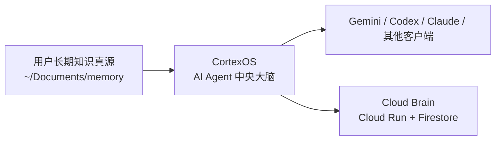
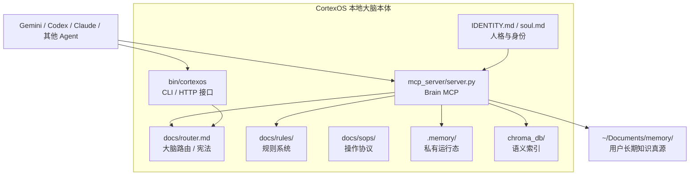
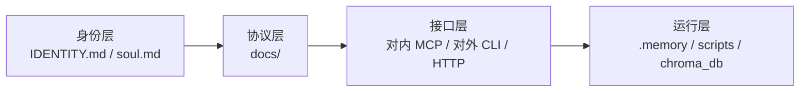
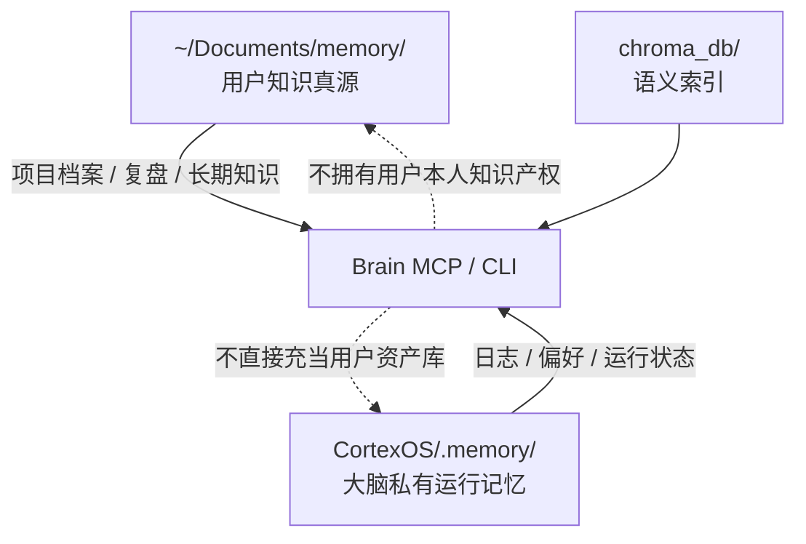
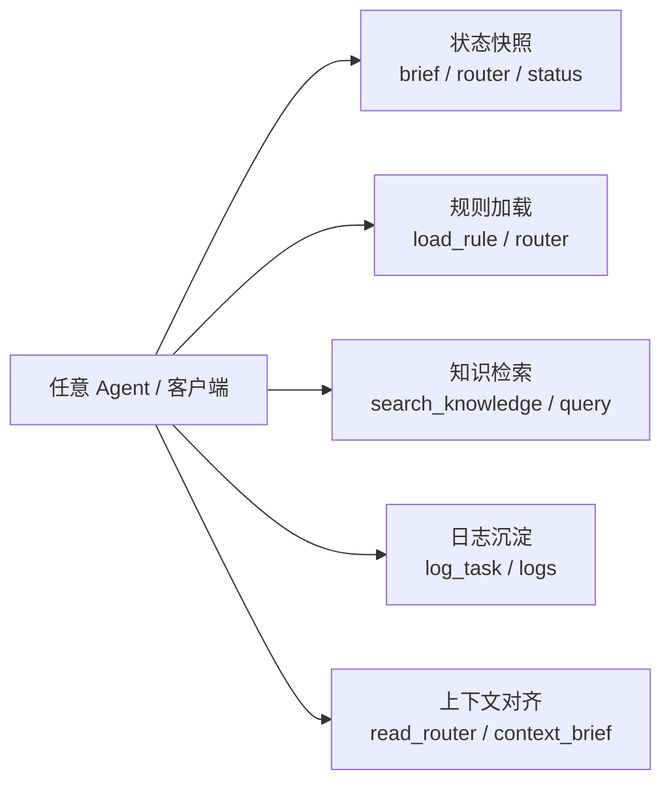
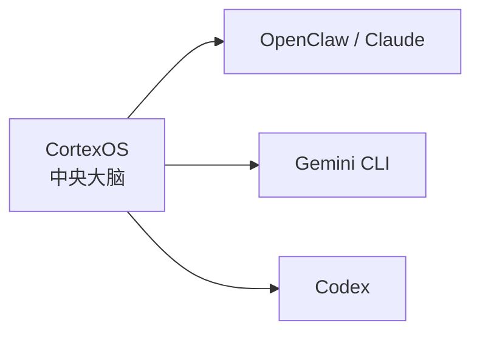
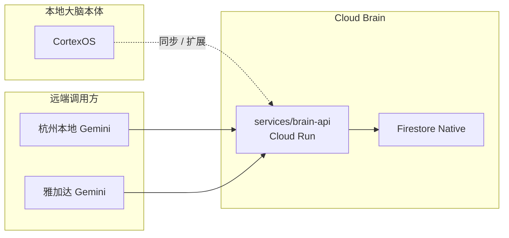
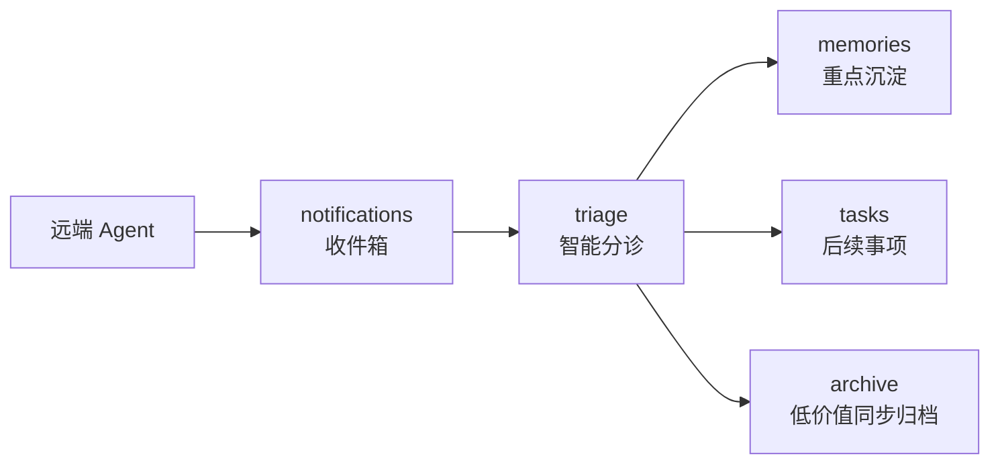
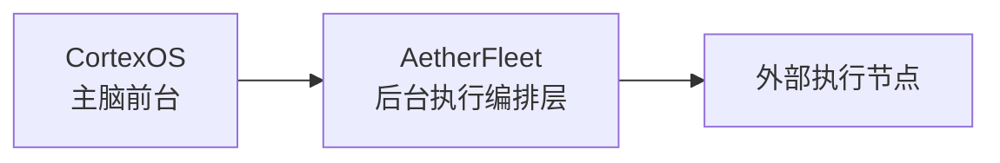
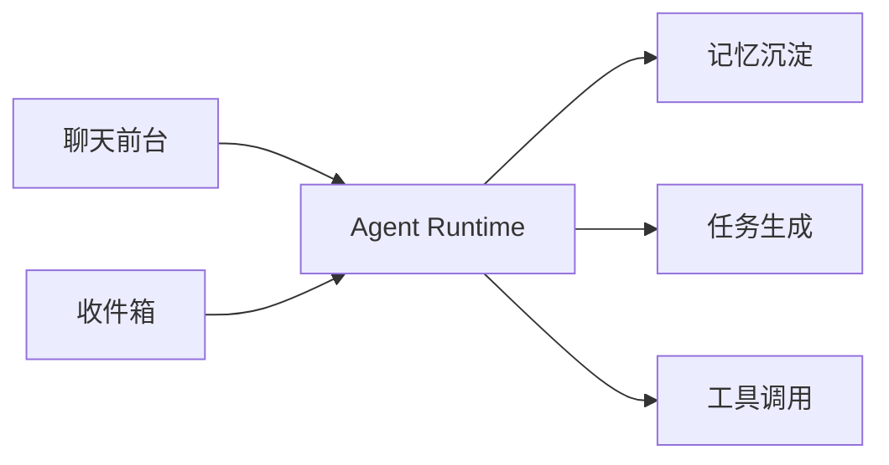

# 技术架构图

> 这份文档只描述 **CortexOS 自己**。
>
> 它不是 AI Team，不是任务看板，也不是任何外部调度器。
> 你可以把它理解成：**一个有记忆、有规则、有接口的 AI Agent 中央大脑**。

## 1. CortexOS 的正确定位

- `CortexOS` 是 `webkubor` 的 **AI Agent 中央大脑**
- `~/Documents/memory/` 是 **用户长期知识真源**
- `Cloud Run + Firestore` 是 **云端共享大脑扩展**
- 对内通过 **MCP**
- 对外通过 **CLI / HTTP API**
- 面向各类 **subagent / 客户端**

所以边界应该这样理解：

关键点：

1. `CortexOS` 不是调度器
2. `CortexOS` 不是队长系统
3. `CortexOS` 的本职是：规则、记忆、路由、上下文对齐

## 2. 当前本地本体结构

## 3. 大脑内部四层

### 分层职责

| 层 | 真实路径 | 职责 |
|---|---|---|
| 身份层 | `IDENTITY.md`、`soul.md` | CortexOS 的人格、称谓、身份连续性 |
| 协议层 | `docs/` | 路由、规则、SOP、进化史 |
| 接口层 | `mcp_server/`、`bin/cortexos` | 对外暴露统一能力入口 |
| 运行层 | `.memory/`、`scripts/`、`chroma_db/` | 私有状态、日志、索引、维护逻辑 |

## 4. 数据边界图

这是 CortexOS 最重要的边界，不然会把“用户知识”“大脑私有记忆”“云端共享状态”混在一起。

### 当前边界原则

1. `~/Documents/memory/` 是用户知识真源
2. `CortexOS/.memory/` 是 CortexOS 自己的私有运行态
3. `Cloud Brain` 是 CortexOS 的云端共享延展，不是另一套脑
4. 外部执行系统如果存在，也只能作为 CortexOS 的**外部输入源**

## 5. CortexOS 对外提供什么

CortexOS 作为一个 AI Agent 中央大脑，对外真正提供的是这些能力：

### 当前接口形式

| 接口 | 位置 | 用途 |
|---|---|---|
| Brain MCP | `mcp_server/server.py` | 面向支持 MCP 的 Agent |
| CLI | `bin/cortexos` | 面向 shell / 脚本 / 任何能跑命令的客户端 |
| HTTP（本地） | `cortexos serve` | 面向不方便直接跑 CLI 的调用方 |

## 6. 外部客户端在什么位置

这一块是为了防止把任意客户端误画进 CortexOS 本体。

解释：

- 各种客户端都是 CortexOS 的**消费者**
- 它们可以读 CortexOS，也可以把摘要/事件回写给 CortexOS
- 但它们都不是 CortexOS 的组成部分

## 7. 云端大脑扩展

你现在在做的 `Cloud Run + Firestore`，不是替换本地大脑，而是给这个中央大脑加一个**跨地区共享层**。

### 云端大脑内部结构

这里的关键边界是：

1. `notifications` 只是收件箱，不是长期知识
2. `memories` 只收重点结论和高价值事实
3. `tasks` 只收需要后续动作的事项
4. `triage` 负责“收到后怎么处理”，而不是把所有内容直接塞进记忆库

### 这层的角色

- **本地 CortexOS**：主脑本体
- **Cloud Brain**：共享入口
- **远端 Gemini / 本地 Gemini**：客户端

### 当前已落地

- GCP 项目：`webkubor`
- Firestore：`asia-southeast2`
- 本地服务代码：`services/brain-api/`
- Cloud Run 服务名：`brain-api`
- 当前服务地址：`https://brain-api-675793533606.asia-southeast2.run.app`

这意味着：

1. CortexOS 仍然是你的中央大脑
2. Cloud Run 只是让“多地点、多 Agent 共享记忆”变得可行
3. 它不是新脑，只是 CortexOS 的云端延展

## 8. 外部编排层的位置

如果 `AetherFleet` 继续存在，它只能被视为 **CortexOS 的外部执行编排层**，而不是大脑本体。

边界规则：

1. `CortexOS` 决定收到什么、记住什么、分发什么
2. `AetherFleet` 负责谁在线、谁执行、任务执行态如何变化
3. `AetherFleet` 不再承担 CortexOS 的主入口叙事

更具体的去留判断见：

- [cortexos-aetherfleet-boundary](./cortexos-aetherfleet-boundary)

## 9. 当前目录映射

| 模块 | 路径 | 当前定位 |
|---|---|---|
| 大脑协议 | `docs/` | 路由、规则、SOP、架构、进化史 |
| 大脑内核 | `mcp_server/` | 主脑 MCP 工具实现 |
| 大脑接口 | `bin/cortexos` | CLI / 本地 HTTP |
| 大脑私有运行态 | `.memory/` | 日志、私有偏好、运行状态 |
| 知识索引 | `chroma_db/` | 语义检索索引 |
| 云端大脑接口 | `services/brain-api/` | Cloud Run 服务骨架 |

## 10. 读这张图时要记住的判断规则

1. `CortexOS` 是 AI Agent 中央大脑，不是 AI Team
2. `Cloud Brain` 是 CortexOS 的云端延展，不是另一套脑
3. `~/Documents/memory/` 永远是用户长期知识真源
4. 聊天、收件箱、任务、记忆以后都应围绕主脑前台统一组织

## 11. 下一步演进方向

在当前架构基础上，`CortexOS` 最自然的下一步不是继续堆脚本，而是长出一个真正可交互的中央大脑前台。

建议路线：

更完整的分阶段计划见：

- [brain-agent-roadmap](./brain-agent-roadmap)

### 某个东西是不是 CortexOS 本体的一部分？

判断标准：

1. 它是不是 CortexOS 自己的规则 / 记忆 / 接口 / 私有运行态？
2. 它是不是必须跟着 CortexOS 一起存在？
3. 如果去掉它，CortexOS 还能不能继续作为一个中央大脑工作？

如果答案是否定的，它多半就是**外部系统**，不是大脑本体。

### 以后新增能力时怎么放

- Brain 能力 -> `mcp_server/`、`bin/`、`scripts/`
- Brain 文档 -> `docs/`
- Brain 私有运行态 -> `.memory/`
- Brain 云端扩展 -> `services/brain-api/`
- 外部调度/协作系统 -> 不要再画进 CortexOS 本体结构
