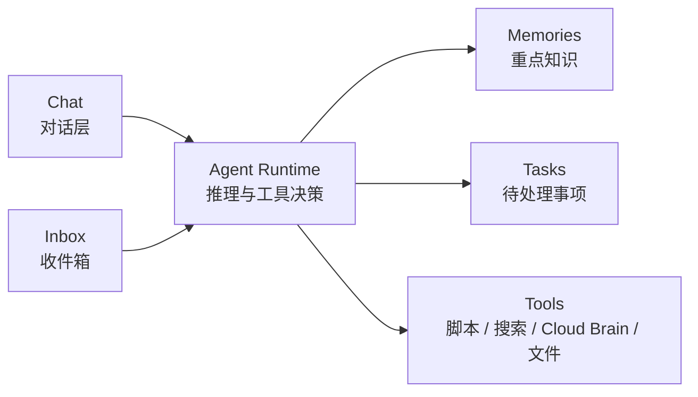
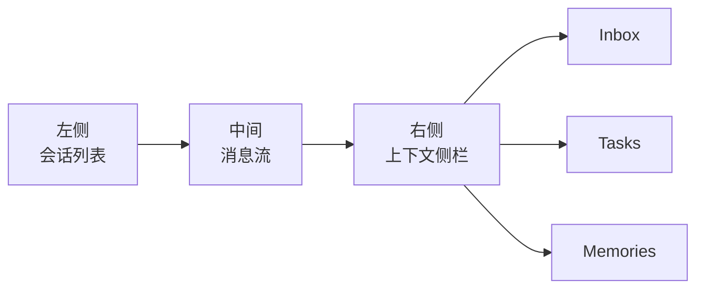

# 中央大脑路线图

> `CortexOS` 的目标不是再做一个普通聊天框，而是成为一个真正可交互的中央大脑。

## 产品定义

`CortexOS` 应该被理解为：

- 一个可对话的中央大脑前台
- 一个有收件箱的消息处理中心
- 一个能提炼重点知识的记忆中枢
- 一个能把事项转成任务的执行入口
- 一个能驱动工具的 Agent Runtime

换句话说：

- `CortexOS` = 主体
- `Gemini / Claude / Codex / MiniMax` = 发动机

## 核心模块

## 页面结构建议

### 左侧

- 会话列表
- 最近收件箱
- 当前任务入口

### 中间

- 你和 CortexOS 的消息流
- 工具调用结果
- 分诊结果与任务生成结果

### 右侧

- 当前命中记忆
- 最近通知
- 当前任务
- 当前会话上下文

## 路线图

### Phase 1：边界与信息架构

目标：先定义清楚 `CortexOS` 到底是什么。

交付：

- 中央大脑架构图
- 产品信息架构
- 数据边界表

### Phase 2：聊天 MVP

目标：先有一个可用聊天前台。

交付：

- 会话列表
- 消息流
- 会话持久化
- 单模型接入

### Phase 3：记忆接入

目标：让聊天不再是空壳。

交付：

- 对话前记忆检索
- 对话后重点沉淀
- 最近记忆侧栏

### Phase 4：收件箱接入

目标：让远端消息进入主脑主流程。

交付：

- 收件箱视图
- 未读状态
- 手动/自动分诊
- 通知转记忆、转任务、归档

### Phase 5：任务接入

目标：让 CortexOS 知道下一步要做什么。

交付：

- 对话生成任务
- 任务状态流转
- 任务和记忆互相引用

### Phase 6：工具运行时

目标：让 CortexOS 不只是会聊天。

交付：

- 文件读取
- 搜索
- Cloud Brain 读写
- 本地脚本动作
- 工具调用结果回流到会话

### Phase 7：模型层抽象

目标：让 CortexOS 不绑定单个模型。

交付：

- 统一模型适配层
- 多模型切换
- 基于任务类型选择模型

## 优先级建议

当前最值得先做的只有三件事：

1. 聊天 MVP
2. 记忆接入
3. inbox 接入

先把这三个做稳，`CortexOS` 就已经像一个真正的中央大脑了。

## 一句话路线

先做：

- 能聊
- 有记忆
- 能收通知
- 能转任务

再做：

- 工具调用
- 多模型切换

不要一开始就把它做成超复杂调度平台。
