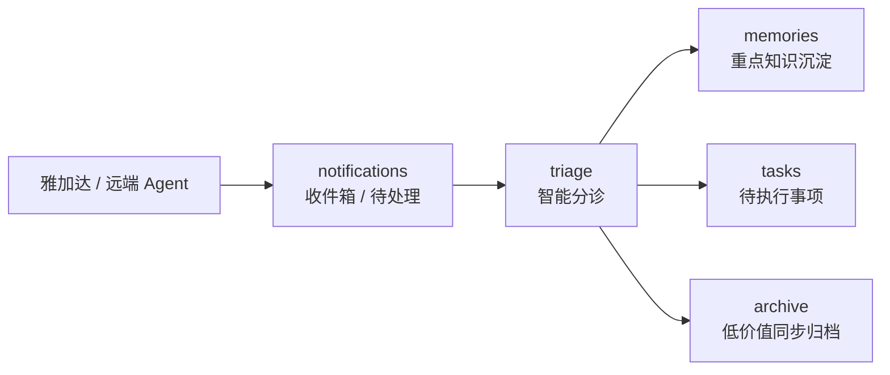

# Cloud Brain 接入说明

## 当前服务

- 服务名：`brain-api`
- Cloud Run 地址：[https://brain-api-675793533606.asia-southeast2.run.app](https://brain-api-675793533606.asia-southeast2.run.app)
- 本地代码：`services/brain-api/`
- 一键部署脚本：`pnpm brain-api:deploy`
- 雅加达子代理独立仓库：[webkubor/jakarta-agent](https://github.com/webkubor/jakarta-agent)

## 当前接口

- `GET /health`
- `POST /memories`
- `GET /memories`
- `POST /notifications`
- `GET /notifications`
- `POST /notifications/:id/triage`
- `POST /tasks`
- `GET /tasks`

## 主脑消息流

Cloud Brain 现在不再把“收到的任何信息”直接视为长期记忆，而是拆成三层：



原则：

1. 外部汇报先进入 `notifications`
2. 主脑只把重点信息提升为 `memories`
3. 需要动作的内容进入 `tasks`
4. 普通同步和心跳默认归档，不污染长期记忆

## 鉴权规则

- `/health` 保持开放，用于探活
- 其他接口使用：

```text
Authorization: Bearer <BRAIN_API_TOKEN>
```

如果 Cloud Run 已设置 `BRAIN_API_TOKEN`：

1. 未携带 token -> `401 unauthorized`
2. token 错误 -> `401 unauthorized`
3. token 正确 -> 可正常读写

## 一键部署

先设置 token：

```bash
export BRAIN_API_TOKEN=replace-with-a-long-random-token
```

然后在仓库根目录执行：

```bash
pnpm brain-api:deploy
```

脚本会自动使用：

- 当前 `gcloud` 项目
- 默认区域 `asia-southeast2`
- 服务账号 `brain-api@<project>.iam.gserviceaccount.com`
- 源目录 `services/brain-api/`

## 雅加达 Gemini Agent 接入方式

建议在雅加达服务器固定这两个环境变量：

```bash
export BRAIN_API_URL="https://brain-api-675793533606.asia-southeast2.run.app"
export BRAIN_API_TOKEN='<your-brain-api-token>'
```

### 开工前拉上下文

```bash
curl -s "$BRAIN_API_URL/memories?project=cortexos&limit=20" \
  -H "authorization: Bearer $BRAIN_API_TOKEN"
```

### 汇报消息先发到 inbox

```bash
curl -s -X POST "$BRAIN_API_URL/notifications" \
  -H 'content-type: application/json' \
  -H "authorization: Bearer $BRAIN_API_TOKEN" \
  -d '{
    "project": "cortexos",
    "agent": "gemini",
    "source": "jakarta-server",
    "title": "雅加达节点任务汇报",
    "content": "完成了本次远端节点任务，需要主脑判断是沉淀为知识还是转成后续任务。",
    "tags": ["report", "jakarta", "gemini"]
  }'
```

返回值里会带一个 `suggestion`，告诉你当前第一版分诊规则建议它走：
- `memory`
- `task`
- `archive`

### 主脑分诊处理

如果要把一条消息提升为长期知识：

```bash
curl -s -X POST "$BRAIN_API_URL/notifications/<notification-id>/triage" \
  -H 'content-type: application/json' \
  -H "authorization: Bearer $BRAIN_API_TOKEN" \
  -d '{
    "action": "memory",
    "summary": "雅加达节点完成 Cloud Brain 接入验证"
  }'
```

如果要把它转成可执行任务：

```bash
curl -s -X POST "$BRAIN_API_URL/notifications/<notification-id>/triage" \
  -H 'content-type: application/json' \
  -H "authorization: Bearer $BRAIN_API_TOKEN" \
  -d '{
    "action": "task",
    "summary": "确认 Cloud Brain 二期鉴权与接入规范"
  }'
```

### 直接查看主脑 inbox

```bash
curl -s "$BRAIN_API_URL/notifications?project=cortexos&status=new&limit=20" \
  -H "authorization: Bearer $BRAIN_API_TOKEN"
```

### 直接查看任务池

```bash
curl -s "$BRAIN_API_URL/tasks?project=cortexos&limit=20" \
  -H "authorization: Bearer $BRAIN_API_TOKEN"
```

## jakarta-agent 独立子仓库

为了遵守 SSOT，雅加达节点客户端已经独立到单独仓库：

- [webkubor/jakarta-agent](https://github.com/webkubor/jakarta-agent)

印尼服务器应直接使用那个仓库，而不是读取 CortexOS 内部子目录。

示例：

```bash
git clone https://github.com/webkubor/jakarta-agent.git
cd jakarta-agent
pnpm install
pnpm health
pnpm read cortexos 10
pnpm write cortexos "雅加达节点完成了本轮任务。"
```

## 推荐的接入习惯

1. 开工前先拉最近 10-20 条项目记忆
2. 收工后先发一条 `notification` 到 inbox
3. 让主脑再决定它是进 `memories` 还是进 `tasks`
4. 记录里要写清：
   - `project`
   - `agent`
   - `source`
   - `content`
   - `tags`

## 本地主脑 inbox

现在 CortexOS 本地已经新增 inbox 轮询器：

```bash
pnpm brain:inbox:check
```

它会做四件事：

1. 从 Cloud Brain 拉取当前项目的 `notifications`
2. 对新通知做去重，只处理没见过的消息
3. 触发 macOS 系统通知，避免你错过远端汇报
4. 自动按第一版分诊规则把通知提升为 `memory / task / archive`

本地落点：

- 收件箱状态缓存：`.memory/cache/cloud-brain-inbox-state.json`
- 主脑 inbox 视图：`.memory/inbox/cloud-brain-inbox.md`

后台自动维护也已经接入：

- `brain-cortex-pilot` 每轮会自动跑一次 `brain-inbox`

可选环境变量：

```bash
export BRAIN_INBOX_PROJECT="cortexos"
export BRAIN_INBOX_LIMIT=20
export BRAIN_INBOX_AUTO_TRIAGE=true
```

## 下一步建议

当前是第一版收件箱模式，下一步可以继续升级：

1. Secret Manager 管理 `BRAIN_API_TOKEN`
2. Cloud Run 去掉匿名访问
3. 增加主脑本地 inbox 轮询器
4. 扩展 `projects / tasks / identities` 结构
