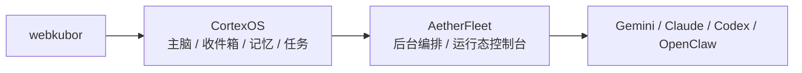

# CortexOS / AetherFleet 边界审计

> 这份文档回答一个核心问题：
>
> `AetherFleet` 现在还要不要存在？
>
> 结论是：**要，但只能作为后台执行编排层存在，不再承担主脑入口。**

## 一句话结论

- `CortexOS` = `webkubor` 的主脑
- `AetherFleet` = 外部执行编排与运行态控制台
- `Gemini / Claude / Codex / OpenClaw` = 执行节点

也就是说：

## 为什么不建议直接删除 AetherFleet

我核过本机的 `AetherFleet` 独立仓库，它不是空仓库，也不是纯历史包袱。

它仍然具备完整的独立系统特征：

- 独立前端：Vue + Vite 单页控制台
- 独立后端：Fleet Bridge + SSE + REST
- 独立运行态：SQLite、心跳、任务流转、队长切换
- 独立进程托管：PM2 `aetherfleet-bridge` / `aetherfleet-frontend`

这意味着它仍然有保留价值，只是不该再跟 `CortexOS` 抢主入口。

## 保留 / 迁移 / 删除矩阵

### 1. 保留在 AetherFleet 的能力

这些能力更像**执行编排层**，不建议塞回 CortexOS：

| 能力 | 说明 | 保留原因 |
|---|---|---|
| Agent 注册与心跳 | `claim/checkin/pulse/cleanup/handover` | 属于运行态，不是主脑长期记忆 |
| 实时状态看板 | 成员在线、离线、任务执行态、SSE | 属于执行层 cockpit |
| 任务执行态桥接 | `fleet-control-bridge`、`fleet/status`、`fleet/action` | 面向节点控制，而不是用户对话 |
| PM2 运行与运维看板 | `aetherfleet-bridge` / `aetherfleet-frontend` | 适合作为后台服务独立托管 |

### 2. 迁移或收口到 CortexOS 的能力

这些能力更适合纳入**主脑前台**：

| 能力 | 当前状态 | 建议 |
|---|---|---|
| 收件箱 | 已在 Cloud Brain + `brain-inbox` 落地 | 继续放在 CortexOS |
| 重点记忆 | 已在 `memories` 落地 | 继续放在 CortexOS |
| 任务分诊 | 已在 `notifications -> triage -> tasks` 落地 | 继续放在 CortexOS |
| 主入口叙事 | 已从文档中去 AetherFleet 化 | 保持 CortexOS 唯一入口 |
| 用户对话前台 | `BrainAgentConsole` 原型已存在 | 继续在 CortexOS 内演进 |

### 3. 可以从 CortexOS 中删除的 AetherFleet 残留

这些内容不该继续留在主脑后台或主叙事中：

| 残留 | 当前处理策略 |
|---|---|
| AetherFleet 作为主脑叙事 | 已从 README / router / architecture 中移除 |
| `brain-cortex-pilot` 里的 Fleet 维护任务 | 继续移除，只保留主脑后台任务 |
| 主脑页面里对舰队/调度的命名依赖 | 后续继续清理 |

## 推荐的长期结构

### CortexOS 负责什么

- 收件箱（notifications inbox）
- 记忆（memories）
- 任务分诊（triage -> tasks）
- 主脑对话前台
- 规则、路由、上下文对齐

### AetherFleet 负责什么

- Agent 在线状态
- 节点心跳与生命周期
- 执行态任务池
- SSE / REST bridge
- 后台调度与运维可视化

### 执行节点负责什么

- 接任务
- 执行
- 汇报
- 回传结果

## 当前建议

### 推荐方案：保留为后台编排层

这是目前最稳的方案：

1. `CortexOS` 做唯一主入口
2. `AetherFleet` 退到后台执行编排层
3. 日常使用优先进入 `CortexOS`
4. 只有需要看节点态、任务执行态、桥接链路时才进入 `AetherFleet`

### 不推荐方案：立即删除

不建议现在直接删掉 `AetherFleet`，原因是：

- 执行态桥接逻辑仍然集中在它内部
- 实时节点状态与控制桥仍然独立可用
- 直接删除会让执行编排层出现真空

## 实施顺序

1. `CortexOS` 保持主脑入口唯一性
2. 清理 `brain-cortex-pilot` 中所有旧 Fleet 残留
3. 把 `AetherFleet` 定位收口成“后台执行编排层”
4. 后续再评估是否需要把部分编排能力进一步 API 化给 CortexOS 调用

## 判断标准

以后遇到新能力时，用这三句判断放哪边：

1. 这是“主脑知道什么、怎么判断、怎么沉淀”吗？
2. 这是“执行节点当前在线与否、谁在干活、怎么调度”吗？
3. 如果去掉它，CortexOS 还能不能作为主脑继续工作？

如果更接近第 1 条，放 `CortexOS`。
如果更接近第 2 条，放 `AetherFleet`。
